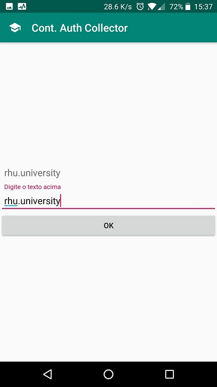
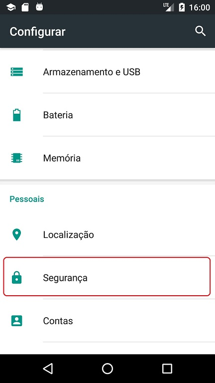
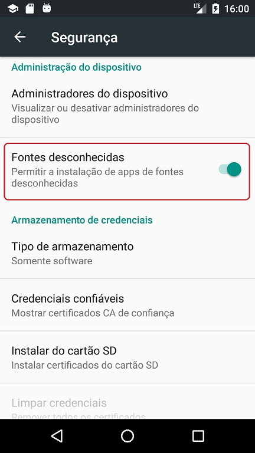

# ContinousAuthCollector - Todos os dados são coletados de forma anônima

Olá, tudo certo?
Se você chegou aqui, é porque está disposto a me ajudar em minha pesquisa.

Para isso, é necessário que você compartilhe de forma anônima algumas informações por um período de 15 dias.
O compartilhamento dessas informações será feito através da instalação do aplicativo que desenvolvi e que o código fonte esta disponível neste mesmo diretório. As informações que serão compartilhadas são:

- Lista de aplicativos utilizados
- Localização
- Histórico de ligações
- Estilometria (Coletado apenas ao inserir os dados no campo do aplicativo)

A lista de aplicativos utilizados, localização e histórico de ligações são compartilhados automaticamente, sem necessidade de nenhuma ação do usuário. A estilometria é coletada apenas quando o usuário recebe a notificação a abre o aplicativo para digitar uma palavra predefinida que será apresentada a ele.

# Instalação
Para instalar o aplicativo, é necessário desativar o Google Play Protect.
Para isso, abra a Play Store > menu > Play Protect

Depois clique em configurações

E desmarque a opção "Verificar ameaças à segurança"

Após isso, é necessário habilitar a instalação de aplicativos de fontes desconhecidas.
Para isso, acesse Configurações > Segurança 

E procure "Fontes desconhecidas". Clique nesse item para habilita-lo.

Também é possivel pular este passo e habilitar a instalação de fontes desconhecidas através do pop-up que irá aparecer ao tentar instalar o aplicativo da pesquisa.

Depois de configurar o aparelhor, baixe o APK "continuousauth.apk" disponibilizado acima ou através deste link do google drive (https://drive.google.com/file/d/1KZrdbWgjdSRBE6qcoOJzNVswxopGy-dp/view?usp=sharing) instale ele em seu aparelho. Depois de instalado clique em abrir e informe sua idade.

Conceda as permissões solicitadas (Android 6.0+)

E habilite o acesso ao dados de utilização

Parabéns, você esta participante da pesquisa!
**Neste ponto a opção de instalação de fontes desconhecidas já pode ser desabilitada.**  
Deixo aqui o meu muito obrigado a todos que se disporem a participar.

# Compartilhando dados de estilometria

Para compartilhar os dados de estilometria, que serão compartilhados apenas quando digitar a palavra solicitada, apenas clique na notificação quando ela aparacer:

Digite o texto solicitado e clique em "OK"

Pronto, você compartilhou as informações com sucesso.

# Dúvidas

Qualquer dúvida ou sugestão, favor entrar em contato através do e-mail rf.santos.alves@gmail.com

